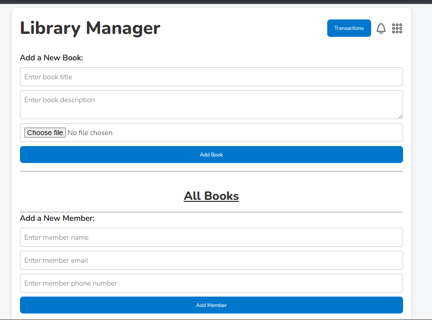
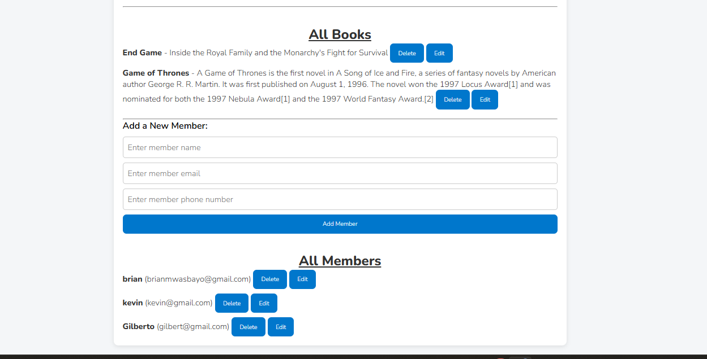
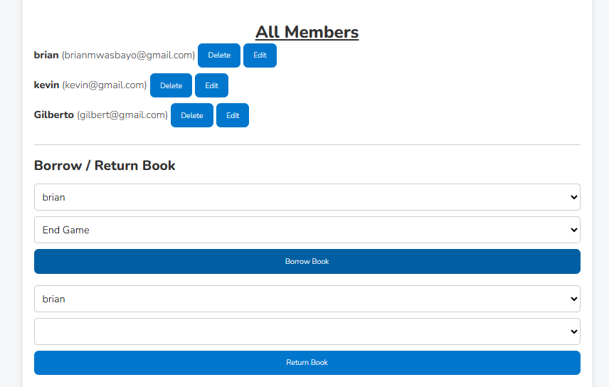

# Library Management System
## Overview 
- The project is typescript project that support CRUD opration ie creating books, deleting,  updating and aloowing members to borrow. Also support the same for members ie can be create member, delete, update, can borrow book that is available.

## Screenshots
- #### Overview

- #### inserting Books and Members

- #### operations

## ⚒️ Techstack Used
- Typescript
- Html
- CSS
- Vercel
- Github

## Thanks for visiting